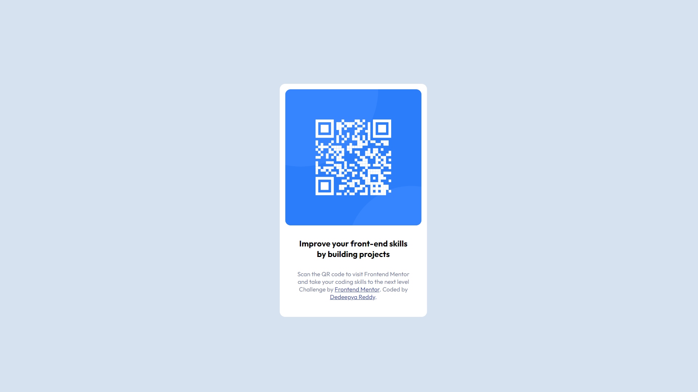

# Frontend Mentor - QR code component solution

This is a solution to the [QR code component challenge on Frontend Mentor](https://www.frontendmentor.io/challenges/qr-code-component-iux_sIO_H). Frontend Mentor challenges help you improve your coding skills by building realistic projects. 

## Table of contents

- [Overview](#overview)
  - [Screenshot](#screenshot)
  - [Links](#links)
- [My process](#my-process)
  - [Built with](#built-with)
  - [What I learned](#what-i-learned)
  - [Continued development](#continued-development)
  - [Useful resources](#useful-resources)
- [Author](#author)

## Overview

### Screenshot




### Links

- Solution URL: [Add solution URL here](https://github.com/hdreddy/Frontendmentor-coding-challenges)
- Live Site URL: [Add live site URL here](https://hdreddy.github.io/Frontendmentor-coding-challenges/)

## My process

### Built with

- Semantic HTML5 markup
- CSS custom properties
- CSS Grid

### What I learned

```html
<a href="https://github.com/hdreddy" target="_blank">Dedeepya Reddy</a>.
```
```css
body{
    text-align: center;
    background-color: hsl(212, 45%, 89%);
    position: absolute;
    top: 50%;
    left: 50%;
    transform: translate(-50%, -50%); 
}
```

### Continued development

- need to focus of HTML elements
- css container positioning


### Useful resources

- [Example resource 1](https://www.w3schools.com/css/css_align.asp) - This helped me for center positioning the div reason. I really liked this pattern and will use it going forward.

## Author

- Website - [Dedeepya Reddy](https://github.com/hdreddy)
- Frontend Mentor - [@hdreddy](https://www.frontendmentor.io/profile/hdreddy)
- Twitter - [@yourusername](https://www.twitter.com/yourusername)
